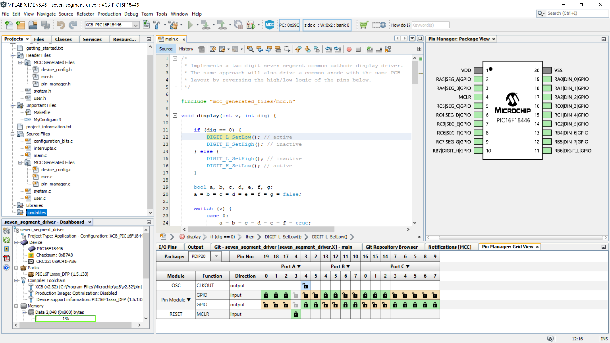

# NES Interface & Peripherals

This project is a peripheral for the SPAM-1 CPU containing a NES gamepad to parallel interface, a random number generator, some 8 bit timers and a basic sound generator.
These are implemented using a microcontroller PIC16F18446.

PIC16F18446 Datasheet: https://ww1.microchip.com/downloads/en/DeviceDoc/40001985B.pdf

I'm building this module for use in a homebrew TTL CPU that I'm building called SPAM-1, and you can see the SPAM-1 git repo in my repository but also take a look at it's youtube videos and the Hackaday project. Ironically this microcontroller has vastly more power than my massive homebrew TTL CPU.

| PIN        | Notes |
| ---------- | ----- |
| VDD        | +ve   |
| _RDNES1    | display the value of NES pad 1 on the parallel port |
| _RDNES2    | display the value of NES pad 2 on the parallel port |
| MCLR       | reset |
| NES_CLK    | clk output to both NES pads |
| NES_LATCH  | latch output to both NES pads |
| NES_DATA_1 | data input from NES pad 1 |
| NES_DATA_2 | data input from NES pad 2 |
| ADCIN      | data input to ADC |
| _RDADC     | display the value of the ADC on the paralel port |
| NU         | not used |
| DATA0-7    | parallel data outputs - thee are froxen during any period where one of the _RDxxx is enabled |

Project Structure
----

The user code is in [_main.c_](https://raw.githubusercontent.com/Johnlon/NESInterfaceAndPeripherals/main/main.c).

UPDATE THIS DOCO ......

This is a straightforward loop that reads the 8 bit data input and then decides which of the seven segment output bits to turn on/off to light the LED's, and also it multiplexes the two digits by applying a low to the DIGIT_L or DIGIT_H pins to select which digit is lit (low to light the digit).

The rest of the files are mostly generated.

The code generation is driven by the MPLab Configurator app that is accessible from the menus.

Using the pin configurator "Pin Manager" grid shown at the bottom of the IDE in the image below, I set the pins as being GPIO inputs or outputs.

Once the config has been decided the hit the _Generate_ button to recreate the config code.

I used the facilities shown below to setup the config. I used the "Pin Module" to uncheck "Analog" on all pins and then renamed the pins to the symbolic names that represents their function. These names show up in the generated code, for example _SEG_A_ for segment 'A'. I also set the two multiplexing pins to start with logic high. This is so that the two digits will be unlit until the microcontroller starts it's program loop. I also turned on the pull ups on the inputs so that they were firmly at a well known value when unconnected rather than floating. 

Hardware and Software Components
------

PCB: https://oshwlab.com/john.lonergan.sharing/7-segment-display-module-using-pic16f18446-microcontroller

Git repo : https://github.com/Johnlon/SevenSegmentModule

Hackaday : https://hackaday.io/project/178227-7-segment-module-using-pic16f18446
