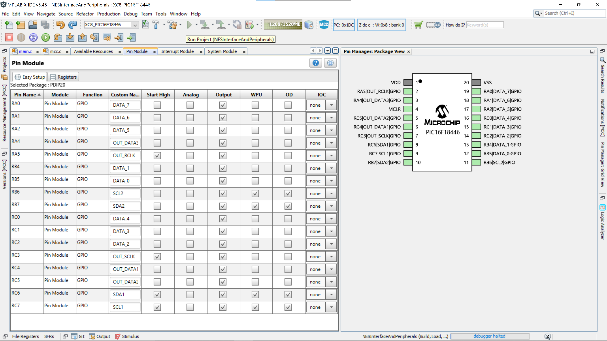

# NES Interface & Peripherals (or how I bit banged the I2C protocol on a PIC micro)

This project is a peripheral adapter for the [SPAM-1 CPU](https://hackaday.io/project/166922-spam-1-8-bit-cpu).

SPAM-1 is a homebrew 'TTL CPU', and you can see the SPAM-1 git repo in my repository but also take a look at it's youtube videos and the Hackaday project. Ironically this microcontroller has vastly more power than my massive homebrew TTL CPU.

This adapter provides an interface for NES gamepads by translating between the I2C protocol of the NES devices and the parallel bus of SPAM-1. SPAM-1 also needs a random number generator so this project also provides a source of random numbers.

# Bit-Banged I2C Implementation

I couldn't find a bit-banged I2C impl for the PIC micro so I did the research and wrote my own. The I2C impl in this repo ought to be reusable by and PIC micro. It could probably be adapter to other micro's if needed with very little effort.

# Genuine NES Controllers vs Clones

## Data format options differ vs a genuine NES controller

This implementation works with the NES Mini gamepad clones that I got off eBay. The controllers do not behave exactly like a genuine controller as they only support "data format 3" which is a high precision version of the NES protocol intended for use with joysticks. Other impl's suggest that genuine controllers will support data format 1. This difference has an impact on how to read the controller. In data format 1 the response from the controller takes 6 bytes where the button data is in bytes 5 and 6, whereas in data format 3 the response is 8 bytes and the button data in bytes 7 and 8. 

If you are using this code with a genuine controller and this code doesn't work then try changing the read function to pull 6 bytes istead of 8.

The diagram below illustrates a full cycle where we read the controller and then write the value out to the shift register.

## Encryption differs vs a genuine controller

The https://wiibrew.org/wiki/Wiimote/Extension_Controllers page explains that there is an old and a new way to disable encryption. 

The new way works on all controllers but the old way only works on genuine NES controllers but this also threw me because most of the code examples I had seen were using the old method and it won't work with clones.

# Hardware

The core of the adapter is a PIC16F18446 microcontroller and in each case the interface back to SPAM-1 is a 74HC595 shift register. The shift registers are needed because it makes the interface back to SPAM-1 easy. The tristate output enable of each of the three shift registers can be addressed by a single control line from SPAM-1 and as there are a bunch of unused outputs on the PIC micro (labelled DATA_0-7 in the image) I might add some more shift registers later if I can figure out what additional functions to add. 

PIC16F18446 Datasheet: https://ww1.microchip.com/downloads/en/DeviceDoc/40001985B.pdf

The pinout I've configured is as follows ...

| PIN        | Notes |
| ---------- | ----- |
| VDD        | +ve   |
| OUT_RCLK   | shift register letch signal |
| OUT_DATA3  | shift register data out - random number out |
| MCLR       | reset / proogramming pin |
| OUT_DATA2  | shift register data out - NES controller 2|
| OUT_DATA1  | shift register data out - NES controller 1 |
| OUT_SCLK   | shift register serial clock |
| SDA1       | I2C data in/out - NES controller 1 |
| SCL1       | I2C clock out - NES controller 1 |
| SDA2       | I2C data in/out - NES controller 2 |
| SCL2       | I2C clock out - NES controller 3 |
| DATA_0-7   | spare GPIO |
| VSS        | 0v |

Project Structure
----

**main.c**

The entry point to the program is [_main.c_](https://raw.githubusercontent.com/Johnlon/NESInterfaceAndPeripherals/main/main.c).

The main loop reads reads the state of each of two NES I2C controllers and generates an 8 bit random number and publishes the three values to the three shift register outputs for consumption but a CPU bus.

**controller.c**

This file contains the high level functions needed to send and receive from the NES controllers. The controllers speak I2C as their low level protocol however there is a specific set of I2C messages that must be sent to the controllers to initialise them and also to read from them. All this logic is within controller.c.

**i2c.c**

This file contains the low level "bit banged" I2C implementation. This is an entirely reusable implementation that any other project that needs a software implementation of I2C on a PIC micro can use.

The header file i2c.h contains the defintion of the I2C data structures and a bunch of functions needed to manipulate the pins to implement the I2C protocol. This file also contains a factory function for each I2C port.

The various port functions are created by a call to macro _PORT_FN_DEF(portno)_. So for instance as I have two ports I need to call this macro in main.c twice as _PORT_FN_DEF(1)_ and _PORT_FN_DEF(2)_. This macro assumes that the pins for the I2C port has been named SCL1/SDA1, SCL2/SDA2 and so on.

**Other files**

The rest of the files are mostly generated by the PIC MPLAB X IDE project configurator.

The configurator can be access from the IDE's config menu:

Using the pin configurator "Pin Manager" grid shown at the bottom of the IDE in the image below, I set the pins as being GPIO inputs or outputs.

Once the config has been decided the hit the _Generate_ button to recreate the config code. 

It's worth observing however that once I had figured out how to use the MPLAB IDE and also how to do the bit-banging of the I2C protocol in the controller.c I decided do all the pin configuration in code instead. The createPort functions configure the pins as open drain with pull-ups enabled as this is the required config for I2C devices. 

# NES and I2C Protocols

Whilst this project works in the actual hardware I'm not very sure about any subtleties in the protocol. 

Certain implementations I've seen do retries on the messaging to the NES device based on failed I2C Acks but I haven't figured that out yet. However, I've not had any issues despite this lack. 

The following documents my impl of the protocol. Start and Stop refer to the I2C start and stop brackets.

## Disable Encryption

We send 0xA4 to signal we're going to write to device 0x52 which is the I2S address used by all WII / NES devices.

A4 is calculated as 0x52 shifted one bit to the left and then the lowest bit left as 0 to indicate in I2C protocol that this is a write operation.

We then emit bytes to write 0xAA to the 0xF0 register which I believe instructs the controller to get ready to receive a sequence of bytes that are the encryption key to use for comms. 

    Start 0xA4 0xF0 0xAA Stop

Setting these encryption bytes to 0x00 disables encryption. We need to send two groups of 6 zeros and the a group of 4 zeros. Before each group we again send 0xA4 to indicate the I2C devices we're going to write to and also 0x40 to indicate the address of the register we're going to write the zeros to.

    Start 0xA4 0x40 0x00 0x00 0x00 0x00 0x00 0x00 Stop

    Start 0xA4 0x40 0x00 0x00 0x00 0x00 0x00 0x00 Stop

    Start 0xA4 0x40 0x00 0x00 0x00 0x00 Stop

## Initialisation

I'm not sure what all the registers being written to below actually do.
Sending 0xA4 as above signals a write to the I2C address 0x52 and then we write 0x55 to reg 0xF0 and so on as shown below.

    Start 0xA4 0xF0 0x55 Stop

    Start 0xA4 0xFB 0x00 Stop

    Start 0xA4 0xFE 0x03 Stop

The one register that I could find some info on is 0xFE and this register holds the value that determines which "data format" is used for the comms. There are data formats 0,1,2 & 3 at least but my clone controllers only do format 3 regardless of the value of 0xFE but as shown above I set that register to 3 in any case so it's consistent at least.

The Nunchuck64 code base in github seems to assume that all controller support data format 0 because it’s hard coded in Nunchuck64's _controller.c_ file and the read function assumes 6 bytes which is data format 0.

By contrast the Hakchi2 “clovercon” code base in github has distinct handlers decoding for each of data formatsformat enums 0,1,2,3 in the function -clovercon_poll()_ within .. https://github.com/ClusterM/hakchi2/blob/stable/clovercon/clovercon.c

in the function clovercon_poll(), we see data format 3 is using the 8 byte approach and data format 0 has 6 bytes and we can also see how to interpret each encoding. 

Btw dataData format 3 is known elsewhere as a “High Resolution” format. Eg https://www.raphnet-tech.com/support/classic_controller_high_res/ and 8 bytes rather than 6 are used as this allows for higher precision on joystick positions, which are not even present in my controller.

## Get controller identification

This function returns some descriptive info about the controller. 

Send 0xA4 to signal a write and then send 0xFA to signal that I will subsequently be reading from this register.

    Start 0xA4 0xFA Stop

Now to do the I first need to send a Start and then 0xA5 which is calculated as 0x52 shifted one place to the left and this set the lower bit to 1 to indicate we are going to be reading not writing. We then read some bytes and close by sending a Stop signal.

    Start 0xA5 <<now read 6 bytes>> Stop

I didn't find much doco on what these 6 identity bytes mean other than the 5th byte being the controller's current data format. This I found is unreliable as I can set this value to anything during initialisation and I always get data format 3 responses. I know nothing about the meaning of the other bytes in the response.

Take a look at https://github.com/ClusterM/hakchi2/blob/stable/clovercon/clovercon.c#L440

    // autodetecting data format
    // it should be 0x03 for original classic controllers and clovercons
    // but seems like not every 3rd party controller supports data format selection
    info->data_format = con_info_data[4];

Any other info on the format would be great but I gound nothing anywhere.

## Read the controller state

Send a write to register 0x00.

    Start 0xFA 0x00 Stop

The start a read by sending 0xA5 then read 8 bytes of controller state. The 8 bytes being data format 3.

    Start 0xA5 <<Read 8 bytes>> Stop

The last two bytes of this 8 bytes response are active low bits that map directly to which buttons are currently pressed.

My _controller.c_ class and the header _controller.h_ show how to decode these bits.

And this was useful, this was one of the first pages I encountered when I couldn’t read my controller. It talks of the data format length (6 vs 8) as a bug in knock-off controllers.  https://www.reddit.com/r/nesclassicmods/comments/5crexz/3rd_party_unlicensed_controller_issues/

Also, 8 byte “high resolution” : https://www.raphnet-tech.com/support/classic_controller_high_res/
 

Other sources of info include http://spinalcode.co.uk/2018/08/14/wii-classic-controller-protocol/ but that page labels the formats as 1,2,3,4 which I think is wrong.

Also, https://github.com/raphnet/extenmote/blob/master/notes_nes_classic.txt

## Noise detection

I found a page that mentions that one should read 21 bytes, of which the first 6 or 8 contain ther data and the rest of which ought to be 0.

See https://www.reddit.com/r/nesclassicmods/comments/5crexz/3rd_party_unlicensed_controller_issues/

The idea is that if any of the latter bytes are not 0 then this is taken to indicate that there was noise on the line and the read should be thrown away and retried.

I don’t do this; I just read 8 bytes.

## Detailed I2C trace

This is a trace of the I2C bus showing the actual data transferred. Trace captured with a low end Salae logic analyser clone.

|Type|duration(us)|Ack|Address|read|data|Comment|
| --- | ----- | ---- | ---- | ---- | ---- | ------------ |
|Start|||||||
|Address|1079|FALSE|0x52|FALSE||Disable encryption|
|Data|1079|FALSE|||0xF0||
|data|1079|FALSE|||0xAA||
|stop|||||||
|start|||||||
|address|1079|FALSE|0x52|FALSE||send a load of 0’s|
|data|1079|FALSE|||0x40||
|data|1079|FALSE|||0x00||
|data|1079|FALSE|||0x00||
|data|1079|FALSE|||0x00||
|data|1079|FALSE|||0x00||
|data|1079|FALSE|||0x00||
|data|1079|FALSE|||0x00||
|stop|||||||
|start|||||||
|address|1079|FALSE|0x52|FALSE||send a load of 0’s|
|data|1079|FALSE|||0x40||
|data|1079|FALSE|||0x00||
|data|1079|FALSE|||0x00||
|data|1079|FALSE|||0x00||
|data|1079|FALSE|||0x00||
|data|1079|FALSE|||0x00||
|data|1078|FALSE|||0x00||
|stop|||||||
|start|||||||
|address|1079|TRUE|0x52|FALSE||send a load of 0’s|
|data|1078|TRUE|||0x40||
|data|1078|TRUE|||0x00||
|data|1079|TRUE|||0x00||
|data|1078|TRUE|||0x00||
|data|1079|TRUE|||0x00||
|stop|||||||
|start|||||||
|address|1079|TRUE|0x52|FALSE||Controller init|
|data|1079|TRUE|||0xF0||
|data|1079|TRUE|||0x55||
|stop|||||||
|start|||||||
|address|1079|TRUE|0x52|FALSE|||
|data|1080|TRUE|||0xFB||
|data|1079|TRUE|||0x00||
|stop|||||||
|start|||||||
|address|1078|TRUE|0x52|FALSE||Set data format 3|
|data|1079|TRUE|||0xFE||
|data|1078|TRUE|||0x03||
|stop|||||||
|start|||||||
|address|1079|TRUE|0x52|FALSE||Get Controller Id|
|data|1079|TRUE|||0xFA||
|stop|||||||
|start|||||||
|address|1079|TRUE|0x52|TRUE|||
|data|813|TRUE|||0x01||
|data|814|TRUE|||0x00||
|data|814|TRUE|||0xA4||
|data|814|TRUE|||0x20||
|data|814|TRUE|||0x03|.. echoes back the format 0x03 theat I specified during the init above |
|data|814|FALSE|||0x01||
|stop|||||||
|start|||||||
|address|1078|TRUE|0x52|FALSE||Read State|
|data|1078|TRUE|||0x00||
|stop|||||||
|start|||||||
|address|1079|TRUE|0x52|TRUE|||
|data|814|TRUE|||0x81||
|data|813|TRUE|||0x81||
|data|814|TRUE|||0x81||
|data|813|TRUE|||0x81||
|data|814|TRUE|||0x00||
|data|813|TRUE|||0x00||
|data|814|TRUE|||0xFF|0xFF means no buttons were pressed (active low)|
|data|814|FALSE|||0xFF|No buttons pressed (active low)|
|stop|||||||
|start|||||||
|address|1079|TRUE|0x52|FALSE||Read State …|
|||||||… as above …|
||||||||

Links
------

Git repo : https://github.com/Johnlon/NESInterfaceAndPeripherals

Hackaday : https://hackaday.io/project/181036-nes-controller-interface-using-pic16f18446
